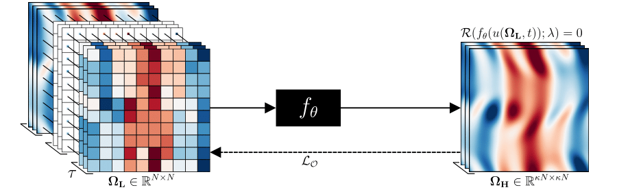

[PISR :: Physics-Informed CNNs for Super-Resolution of Sparse Observations on Dynamical Systems](https://arxiv.org/abs/2210.17319)
=======
**Authors:** Daniel Kelshaw, Georgios Rigas, Luca Magri
<br>**Venue:** Accepted to NeurIPS 2022 Workshop on Machine Learning and the Physical Sciences

## Abstract
<div style="text-align: justify">
In the absence of high-resolution samples, super-resolution of sparse observations on dynamical systems is a challenging
problem with wide-reaching applications in experimental settings. We showcase the application of physics-informed convolutional
neural networks for super-resolution of sparse observations on grids. Results are shown for the chaotic-turbulent Kolmogorov
flow, demonstrating the potential of this method for resolving finer scales of turbulence when compared with classic interpolation
methods,and thus effectively reconstructing missing physics.
</div>

&nbsp;



&nbsp;

## Getting Started
All code to reproduce experiments can be found in the `./src` folder:

1. Generate data using `./src/data/generate_kolmogorov.py`
2. Train model using `./src/experiments/base_experiment.py`

Defaults have been set to the same as used in the paper.

## Citation

```text
@inproceedings{Kelshaw2022,
  title = {Physics-Informed CNNs for Super-Resolution of Sparse Observations on Dynamical Systems},
  author = {Daniel Kelshaw and Georgios Rigas and Luca Magri},
  booktitle = {NeurIPS 2022 Workshop on Machine Learning and the Physical Sciences},
  year = {2022},
  url = {https://arxiv.org/abs/2207.00556},
}
```
